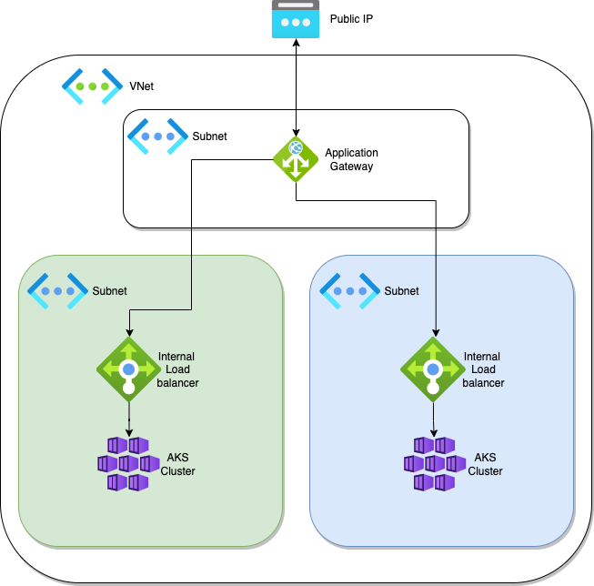

<h1>crederauk/aks-blue-green</h1>

<h2>Description</h2>

    An example approach to using Terraform, Helm, Kubernetes manifests and Github Actions deployment of AKS using a blue green deployment methodology fronted by Appliction Gateway for minimal downtime cluster changes.

<h2>Architecture</h2>

    

    The diagram is meant as a reference only - it shows two AKS clusters (one blue and one green) in reality, this would only be the state if a new cluster was being tested/prepared.

<h2>Deployment</h2>

    The order of deployment is as follows
    <ol>
        <li>
            <code>./terraform/base_infra</code>
        </li>
        <li>
            <code>./terraform/aks/blue</code> and/or <code>./terraform/aks/green</code>
        </li>
        <li>
            <code>./terraform/agw</code>
        </li>
    </ol>

    Automated deployment uses the GithubActions Pipeline defined at <code>.github/workflows/deploy.yaml</code>. this relies on inputs passed into the pipeline at runtime and some github secrets seen in the pipeline file.

    Deployment can be done locally from your terminal in the order set out above:
    <ol>
        <li>
            Set up a <code>terraform.tfvars</code> file in the Terraform directory that contains values for all variables set up in the <code>variables.tf</code> file
        </li>    
        <li>
            <code>cd</code> into the Terraform directory
        </li>
        <li>
            Run <code>terraform init</code> to initialise your remote backend (you can use a local statefile by commenting out the <code>backend</code> block within the <code>terraform</code> block in each <code>providers.tf</code> but will need to point the remote state lookups at the local statefiles that are created)
        </li>
        <li>
            Run <code>terraform plan</code> - to see if the expected resources will be created/you are not destroying any existing infrastructure
        </li>
        <li>
            Run <code>terraform apply</code> - to create the infrastructure
        </li>
    </ol>

<h2>Related Docs</h2>

    There is a <a href="#" class="TODO-ADD BLOG URL">blog on Medium</a> that walks you through deploying the infrastructure

<h2>Additional Information</h2>

    There is currently a manual step to assign a role to the AKS cluster, as the CI SPN does not have permissions to do this - this command will need running when the aks deploy pipeline times out/fails to run helm: <code>az role assignment create --assignee-object-id 
    $AKS_MANAGED_IDENTITY_OBJECT_ID --role "Network Contributor" --scope $AKS_SUBNET_ID</code>
 

 
   
    This can be achived in one line with the following command: 
<pre><code>az role assignment create --assignee-object-id $(az aks show --name aks-cluster-$CLUSTER_COLOUR --resource-group aks-rg | jq -r '.identity.principalId') --role "Network Contributor" --scope $(az network vnet subnet list -g aks-rg --vnet-name aks-vnet | jq -r '.[] | select( .id | contains("$CLUSTER_COLOUR")) | .id')</code></pre>

